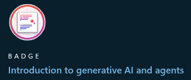

<h2> Hi! </h2>

  

I'm **Luíza Nurnberg**, a Software Engineer who loves exploring new technologies, solving problems with code and learning continuously.  

### Stack
- **Backend:** Node.js, TypeScript, Express, Python (Flask, Django), Java (Spring Boot)  
- **Databases:** PostgreSQL, MongoDB  
- **Cloud & Infra:** AWS, Docker  
- **Other skills:** Kotlin (desktop/mobile), C#

### What I studied recently

  

    
    

      Badge earned from the <strong>MongoDB Fundamentals of Data Transformation</strong> course on MongoDB University
    

  

  

    
    

      Badge earned from the <strong>Introduction to Generative AI and Agents</strong> course on Microsoft
    

  

